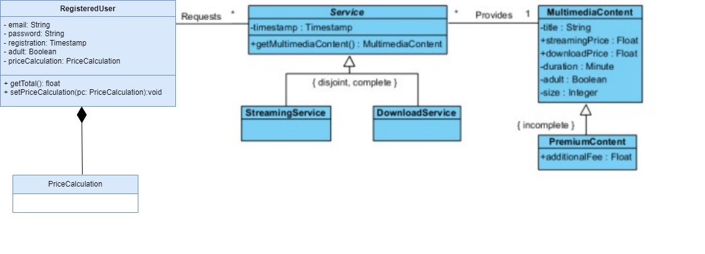

### Ejercicio 1

1 . Que problemas detecas en la operación y razona la respuesta.

En la operación detecto varios problemas que pueden tener un impacto en un futuro y requerir la módificación de la lógica:

- **Tipos de servicio**: Actualmente existen 2 tipos de servicio, si en un futuro se agregan más servicios se va a tener que modificar el código
- **Tipos de contenido**: Actualmente existen 1 tipos de contenido multimedia, si en un futuro se agregan más tipos se va a tener que modificar el código
- **Dependencia estructura de clases**: Actualmente la operación getTotal depende completamente de las clases, sus relaciones y sus heréncias

2 . Propón una solución alternativa (también en pseudocódigo del mismo estilo) que corrija los problemas de la operación getTotal de RegisteredUser que has detectado en la pregunta anterior. Realiza todos los cambios que consideres necesarios en cualquiera de las clases del modelo del enunciado

La solución alternativa para que en un futuro el impacto sea menor, surge al en encontrar una solución al problema 3 (Dependencia estructura de clases)
Para evitar esta fuerta dependencia en la operación getTotal se puede plantear desacoplar la lógica del calculo del precio de un servicio de la estructura específica de clases, para que si en un futuro añadimos nuevos tipos de servicios o nuevos contenidos de multimedia facilitar su incorporación y no se modifique la operación getTotal

Para poder desacoplar ese cálculo añado una nueva clase PriceCalculation, que será la responsable de toda esa lógica. Esta nueva clase tendrá una relación con la RegisteredUser de composición, implicando que un objeto de la clase RegisteredUser es responsable de la creación y destrucción de objetos de la clase PriceCalculation y que la existencia de esta última esta vinculada directamente a la existencia de la primera. El usuario registrado tiene accesible el importe total de los servicios contratados

El diagrama uml quedaría de la siguiente forma:



El pseudocódigo de la operación getTotal quedaría de la siguiente manera:

```js
getTotal() {
  let total = 0;

    this.services.forEach(service => {
        const multimediaContent = service.getMultimediaContent();
        // Delegamos la responsabilidad del cálculo a CalculatePrice para minimizar el impacto futuro
        total += this.priceCalculation.calculatePrice(service, multimediaContent);
    })

    return total;
}
```

El pseudocódigo de la operación calculatePrice quedaría de la siguiente manera:

```js
calculatePrice(service, content) {
  let price = 0;

    if (typeof service == StreamingService) price = content.streamingPrice;
    else if (typeof service == DownloadService) price = content.downloadPrice;
    // En un futuro si se añaden más tipos de servicios añadiré aqui las casuísticas

    if (typeof content == PremiumContent) price += content.additionalFee
    // En un futuro si se añaden más tipos de contenido multimedia añadiré aquí las casuísticas

    return price;
}
```
